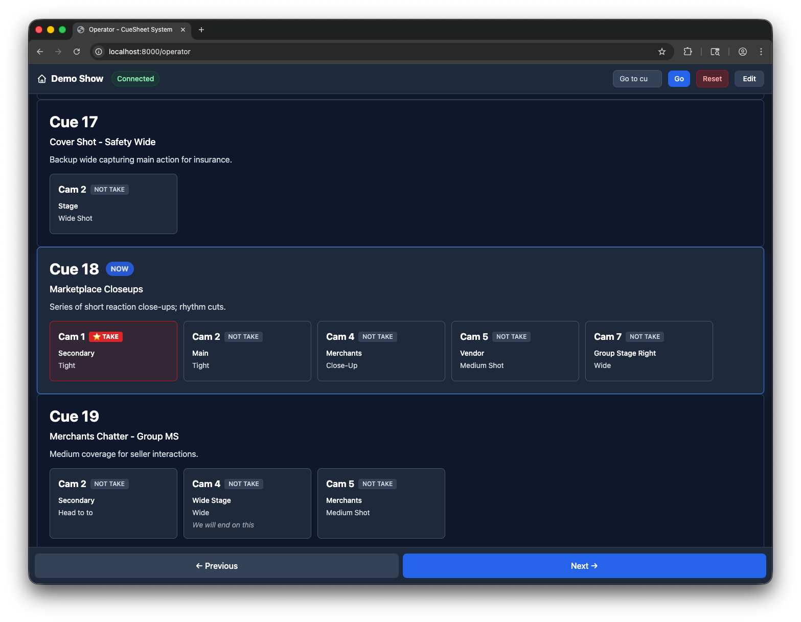
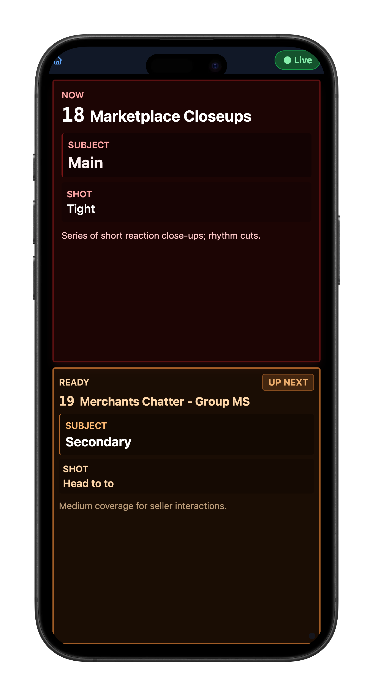

# CueSheet System

A real-time cue tracking and management system for live theatrical and broadcast productions. All views stay perfectly in sync via WebSockets — create and trigger cues while camera operators follow along on unique URLs for their specific cameras, and a global rundown keeps the entire crew on the same page.

|  |
|:---:|
| Operator View |

|  |
|:---:|
| Camera View |

## Technology Stack

- **Backend**: FastAPI (Python 3.11+)
- **Database**: SQLite with aiosqlite
- **Real-time Communication**: WebSockets
- **Frontend**: Vanilla HTML/CSS/JavaScript with Tailwind CSS
- **Package Manager**: UV
- **Container Base**: Alpine Linux with Python 3.13

## Running with Docker/Podman

1. Pull the latest container:
```bash
podman pull ghcr.io/ssimpson89/cuesheet:latest
# or with Docker:
docker pull ghcr.io/ssimpson89/cuesheet:latest
```

2. Run with persistent storage:
```bash
podman run -d \
  -p 8000:8000 \
  -v ./data:/app/data \
  --name cuesheet \
  ghcr.io/ssimpson89/cuesheet:latest

# or with Docker:
docker run -d \
  -p 8000:8000 \
  -v ./data:/app/data \
  --name cuesheet \
  ghcr.io/ssimpson89/cuesheet:latest
```

3. Access the application at `http://localhost:8000`

**Note:** The `-v ./data:/app/data` mount ensures your database persists between container restarts.

**Building locally (for development):**
```bash
podman build -t cuesheet:latest -f Containerfile .
```

## Running Locally

1. Install UV (if not already installed):
```bash
curl -LsSf https://astral.sh/uv/install.sh | sh
```

2. Install dependencies:
```bash
uv sync
```

3. Run the server:
```bash
uvicorn app.main:app --reload
```

4. Access the application at `http://localhost:8000`

## Configuration

### Environment Variables

| Variable | Description | Default Value | Notes |
|----------|-------------|---------------|-------|
| `DB_PATH` | Database file location | `/app/data/cuesheet.db` (container)<br>`cuesheet.db` (local) | Path to SQLite database file |
| `BACKUP_DIR` | Backup files directory | `backups` | Directory where database backups are stored |
| `BACKUP_COUNT` | Number of backups to retain | `10` | Maximum number of automatic backups to keep |

### Container Configuration

**Volumes:**
- `/app/data`: Database persistence directory

**Ports:**
- `8000`: HTTP server

**Health Check:**
- Endpoint: `/health`
- Interval: 30s
- Verifies web server and database connectivity

## License

MIT
