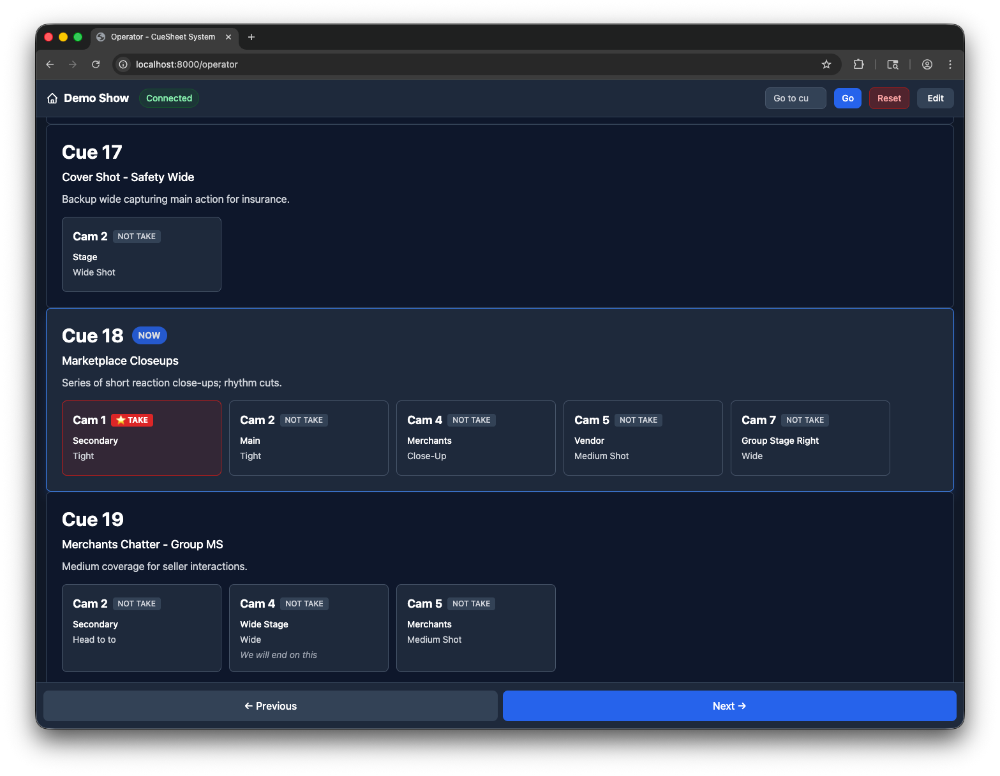
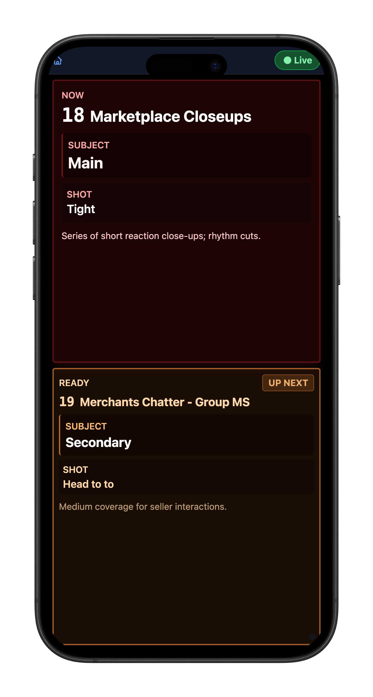

# CueSheet System

A real-time cue tracking and management system for live theatrical and broadcast productions. All views stay perfectly in sync via WebSockets — create and trigger cues while camera operators follow along on unique URLs for their specific cameras, and a global rundown keeps the entire crew on the same page.

|  |
|:---:|
| Operator View |

|  |
|:---:|
| Camera View |

## Technology Stack

- **Backend**: FastAPI (Python 3.11+)
- **Database**: SQLite with aiosqlite
- **Real-time Communication**: WebSockets
- **Frontend**: Vanilla HTML/CSS/JavaScript with Tailwind CSS
- **Package Manager**: UV
- **Container Base**: Alpine Linux with Python 3.13

## Running with Docker/Podman

1. Pull the latest container:

```bash
podman pull ghcr.io/ssimpson89/cuesheet:latest
# or with Docker:
docker pull ghcr.io/ssimpson89/cuesheet:latest
```

2. Run with persistent storage:

```bash
podman run -d \
  -p 8000:8000 \
  -v ./data:/app/data \
  --name cuesheet \
  ghcr.io/ssimpson89/cuesheet:latest

# or with Docker:
docker run -d \
  -p 8000:8000 \
  -v ./data:/app/data \
  --name cuesheet \
  ghcr.io/ssimpson89/cuesheet:latest
```

3. Access the application at `http://localhost:8000`

**Note:** The `-v ./data:/app/data` mount ensures your database persists between container restarts.

**Building locally (for development):**

```bash
podman build -t cuesheet:latest -f Containerfile .
```

## Running Locally

1. Install UV (if not already installed):

```bash
curl -LsSf https://astral.sh/uv/install.sh | sh
```

2. Install dependencies:

```bash
uv sync
```

3. Build the CSS bundle (only needed when templates change):

```bash
npm install
npm run build:css      # or: npm run watch:css  (rebuild on change)
```

The compiled `static/output.css` is committed to the repo, so this step is
optional for a quick run but required if you've edited any templates and
want the new Tailwind classes to appear.

4. Run the server:

```bash
uvicorn app.main:app --reload
```

5. Access the application at `http://localhost:8000`

## Authentication

The admin page is protected by password authentication to prevent unauthorized access.

### Default Credentials

- **Password**: `admin`

### Changing the Password

**Via Admin Page (Recommended):**

1. Log in to `/admin` with the default password
2. Navigate to the "Security & Authentication" section
3. Enter a new password and confirm it
4. Click "Change Password"

**Via Database (Manual):**

If you're locked out or need to reset the password manually, you can use the provided script or update the database directly:

**Use the reset script**

```bash
uv run python scripts/reset_password.py
```

This will reset the password back to the default `admin`. The script automatically detects the database location (works in both development and container environments).

**In a container:**

```bash
# With podman:
podman exec -it cuesheet uv run python scripts/reset_password.py

# With docker:
docker exec -it cuesheet uv run python scripts/reset_password.py
```

### Page Protection

By default:

- **Admin page**: Always requires authentication
- **All other pages**: Open (operator, director, camera, overview)

You can lock individual pages or all pages at once from the admin interface:

1. Log in to `/admin`
2. Scroll to "Page Protection" section
3. Toggle individual pages (Operator, Director, Camera, Overview) or use "Lock All Pages" for convenience

## Configuration

### Environment Variables

| Variable | Description | Default Value | Notes |
|----------|-------------|---------------|-------|
| `DB_PATH` | Database file location | `/app/data/cuesheet.db` (container)<br>`cuesheet.db` (local) | Path to SQLite database file |
| `BACKUP_DIR` | Backup files directory | `backups` | Directory where database backups are stored |
| `BACKUP_COUNT` | Number of backups to retain | `10` | Maximum number of automatic backups to keep |
| `OPENROUTER_API_KEY` | OpenRouter API key for AI features | *(none)* | Required for AI Assistant. Get from [openrouter.ai/keys](https://openrouter.ai/keys) |
| `OPENROUTER_BASE_URL` | OpenRouter API base URL | `https://openrouter.ai/api/v1` | Can be overridden for custom endpoints |

### Container Configuration

**Volumes:**

- `/app/data`: Database persistence directory

**Ports:**

- `8000`: HTTP server

**Health Check:**

- Endpoint: `/health`
- Interval: 30s
- Verifies web server and database connectivity

## MCP Integration

CueSheet exposes a Model Context Protocol (MCP) server that allows AI assistants like Claude Desktop to interact with your cue system programmatically.

### Available MCP Tools

The MCP server provides 14 tools for managing cues and camera assignments:

**Read Operations:**
- `list_all_cues` - Get all cues with camera assignments
- `get_cue_details` - Get detailed information about a specific cue
- `get_current_state` - Get the current playback state
- `list_cameras` - List all cameras and their assignment counts

**Write Operations:**
- `create_cue` - Create a new cue
- `update_cue` - Update an existing cue's text or notes
- `delete_cue` - Delete a cue (renumbers subsequent cues)
- `add_camera_assignment` - Add or update a camera assignment
- `delete_camera_assignment` - Remove a camera assignment

**Utility:**
- `advance_to_cue` - Navigate to a specific cue number
- `export_to_csv` - Export all cues and camera assignments to CSV

### MCP Client Setup

**For Claude Desktop:**

Edit your Claude Desktop configuration file:

**macOS:** `~/Library/Application Support/Claude/claude_desktop_config.json`  
**Windows:** `%APPDATA%\Claude\claude_desktop_config.json`

Add the CueSheet MCP server:

```json
{
  "mcpServers": {
    "cuesheet": {
      "url": "http://localhost:8000/mcp",
      "transport": "http"
    }
  }
}
```

Restart Claude Desktop, and you can now ask Claude to interact with your cue system:

```
"List all cues in the cuesheet"
"Create a new cue with the line 'ALADDIN: One jump ahead'"
"Add camera 1 to cue 5 as a wide shot of the stage"
"Show me the current playback state"
```

**For Other MCP Clients:**

Point your MCP client to: `http://localhost:8000/mcp`

The server uses standard JSON-RPC over HTTP with these methods:
- `tools/list` - Get all available tools
- `tools/call` - Execute a tool

**Authentication:**

The MCP endpoint requires the same authentication as the admin page. Include your session token in requests.

## License

MIT
